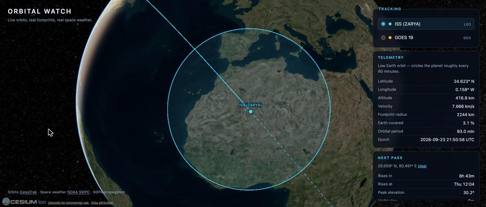
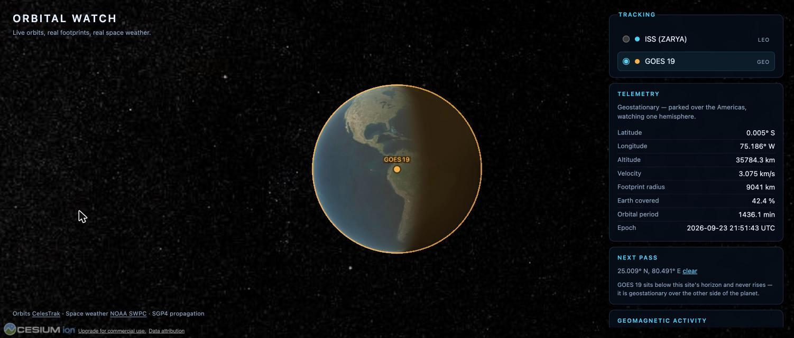

# Orbital Watch

A live, real-physics satellite tracker. Real satellites, their real position, their
real coverage footprint, and real geomagnetic conditions — on a 3D globe.

In *GoldenEye* (1995) the plot turns on a satellite whose footprint sweeps across
the Earth beneath it. Orbital Watch takes that exact visual hook and grounds it
entirely in reality: the circle on screen is the satellite's true
horizon-limited coverage area, the same figure ham operators and ground-station
planners work with. Nothing here is simulated, mocked, or hardcoded — every
number comes from live public data.



## What you can do

- **Watch the ISS move.** Position refreshes every second, propagated from real
  orbital elements. Altitude ~420 km, velocity ~7.66 km/s, one lap every 93 minutes.
- **See the footprint.** The circle is the satellite's horizon, computed from
  geometry — 2245 km radius for the ISS, covering 3.1% of the Earth.
- **Read the ground track.** Solid line for the last 45 minutes, dashed for the
  next 30.
- **Click anywhere on Earth** to get a real next-pass prediction: when the
  satellite rises, how high it climbs, how long it stays up.
- **Switch to GOES 19** and watch the contrast — a geostationary satellite sits
  motionless over the Americas with a 9041 km footprint covering 42.4% of the planet.
- **Check space weather.** NOAA's planetary K-index, colour-coded on the real G-scale.



## How it works

A TLE (Two-Line Element set) is not a position — it is a compact description of
an orbit. Turning one into "where is it right now" takes a propagator, and the
one the aerospace world actually uses is **SGP4**.

```
CelesTrak  ──TLE──▶  /api/tle  ──▶  satellite.js (SGP4)  ──▶  position, velocity
                     (edge, 1h cache)         │
                                              ├──▶  footprint geometry  ──▶  Cesium
                                              ├──▶  ground track sampling
                                              └──▶  forward search  ──▶  next pass

NOAA SWPC  ──Kp──▶  /api/spaceweather  ──▶  G-scale badge
                    (edge, 5min cache)
```

All the physics runs in the browser. SGP4 costs microseconds, so a 1 Hz update
loop is free, and a 48-hour pass search finishes in under 10 ms. The two edge
functions are deliberately dumb: they exist to sidestep upstream CORS and to
cache, not to compute.

### The footprint is geometry, not decoration

For a satellite at altitude `h` above a sphere of radius `R`, the great-circle
angle from the sub-satellite point to the horizon is

```
λ = acos(R / (R + h))
```

and the coverage radius along the surface is `R · λ`. Requiring a minimum
elevation angle `e` (as a ground station would) narrows it to
`acos((R/(R+h))·cos e) − e`.

The boundary is drawn by walking that angular distance out along every bearing
with the spherical destination-point formula. This matters: the usual "draw an
ellipse" approach is approximated in a local tangent plane and visibly collapses
for a geostationary footprint, which spans 81 degrees of arc.

## Stack

- **Vite + React + TypeScript** — static SPA, no server rendering
- **CesiumJS** (raw, mounted in one component) — 3D globe and imagery
- **satellite.js** — SGP4 propagation, entirely client-side
- **Cloudflare Pages** — static hosting plus two Pages Functions as data proxies

| Source | Used for | Route |
|---|---|---|
| [CelesTrak](https://celestrak.org) | Two-line orbital elements | `/api/tle?name=<catalogue name>` |
| [NOAA SWPC](https://services.swpc.noaa.gov) | Planetary K-index | `/api/spaceweather` |

## Getting started

```bash
npm install
cp .env.example .env.local   # then paste in your Cesium Ion token
npm run dev
```

A free **Cesium Ion access token** is required for Earth imagery — get one at
[cesium.com/ion/tokens](https://cesium.com/ion/tokens) and set
`VITE_CESIUM_ION_TOKEN` in `.env.local`. It is a client-side token by nature, so
it carries Vite's `VITE_` prefix.

`npm run dev` also serves the Pages Functions, so `/api/*` works locally against
the same handler code that runs in production.

## Scripts

| Script | What it does |
|---|---|
| `npm run dev` | Dev server, with `/api/*` handled by the real function code |
| `npm run build` | Typecheck all three TS projects, then build to `dist/` |
| `npm run preview` | Serve the build statically (no `/api/*`) |
| `npm run preview:cf` | Serve the build through Wrangler — closest to production |
| `npm run deploy` | Build and deploy to Cloudflare Pages |
| `npm run lint` / `npm run typecheck` | oxlint / `tsc -b` |

## Layout

```
functions/api/          Pages Functions (Workers runtime, web APIs only)
  tle.ts                CelesTrak proxy
  spaceweather.ts       NOAA SWPC proxy
src/
  components/
    Globe.tsx           The only file that touches Cesium or WebGL
    TelemetryPanel.tsx  SatellitePicker.tsx  NextPassFinder.tsx  SpaceWeatherBadge.tsx
  hooks/
    useSatelliteRecord.ts    TLE fetch + hourly refresh
    useLiveSatelliteState.ts 1 Hz propagation loop
    useGroundTrack.ts        coarse-cadence track resampling
    useSpaceWeather.ts       5-minute Kp poll
  lib/
    satellites.ts       catalogue, TLE parsing, propagation, pass search
    footprint.ts        coverage geometry
    spaceWeather.ts     Kp fetch + NOAA G-scale classification
    sun.ts              subsolar point, used to frame the opening shot
    types.ts            shared domain types
scripts/                stages Cesium's runtime assets into public/
vite-plugins/           runs functions/api/* on the dev server
```

## Deployment

Cloudflare Pages, connected to this repo:

- Build command: `npm run build`
- Output directory: `dist`
- Environment variable: `VITE_CESIUM_ION_TOKEN` (needed at **build** time — Vite
  inlines it into the bundle)

## Notes for anyone extending this

- **Everything WebGL lives in `Globe.tsx`.** Cesium owns its canvas; React never
  renders into that subtree. Entities are mutated imperatively in effects.
- **Do not use `clampToGround` for the ground track.** Draping asks Cesium to
  load terrain detail along the whole path; an ISS track spans some 20,000 km,
  which keeps the tile queue permanently busy and the globe never finishes
  loading. The track renders on the ellipsoid instead, a few km up to avoid
  z-fighting.
- **The edge functions must stay Node-free.** They run on the Workers runtime:
  web APIs only, no `fs`, no native modules.

## Non-goals

No weapons or harm simulation of any kind — the footprint is coverage and
visibility only. No accounts, no database, no more than two satellites in v1.
