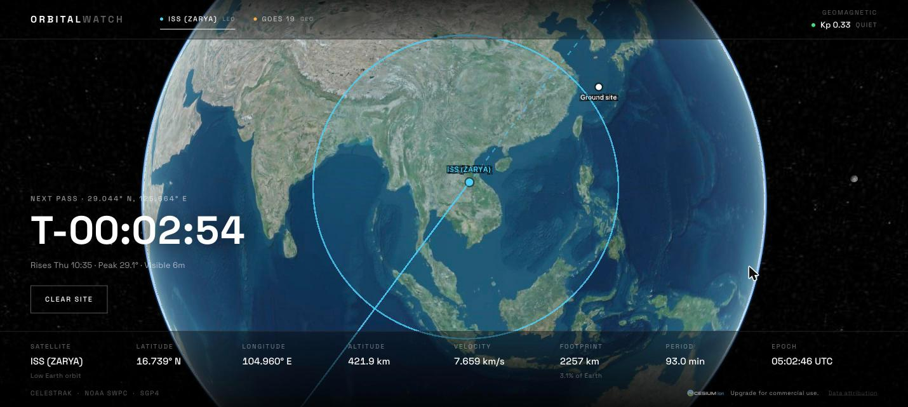
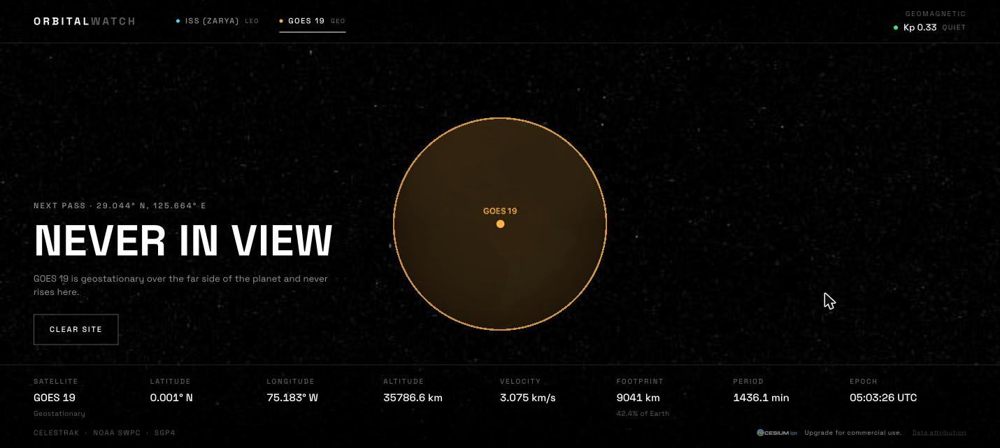
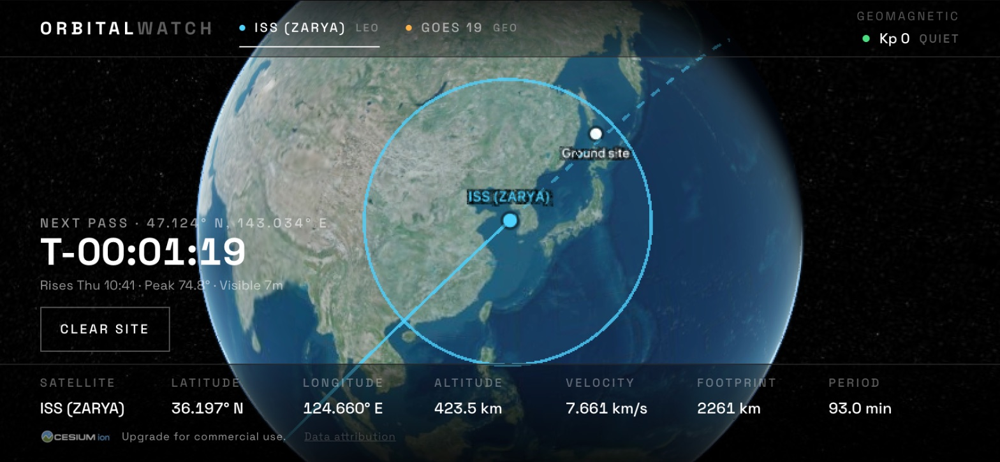
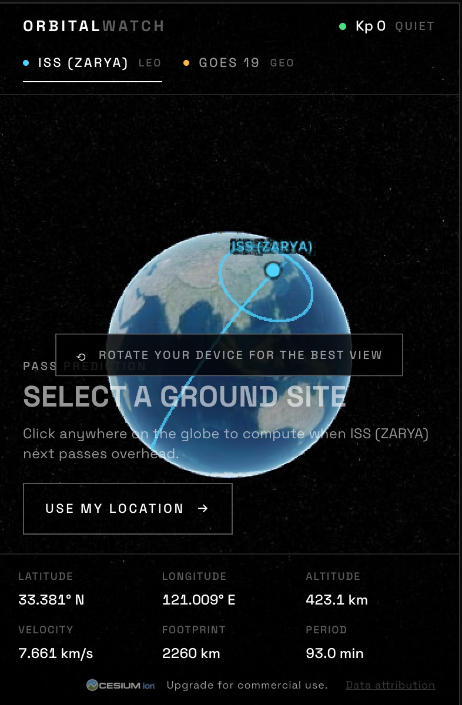

# Orbital Watch

A live, real-physics satellite tracker. Real satellites, their real position, their
real coverage footprint, and real geomagnetic conditions — on a 3D globe.

In *GoldenEye* (1995) the plot turns on a satellite whose footprint sweeps across
the Earth beneath it. Orbital Watch takes that exact visual hook and grounds it
entirely in reality: the circle on screen is the satellite's true
horizon-limited coverage area, the same figure ham operators and ground-station
planners work with. Nothing here is simulated, mocked, or hardcoded — every
number comes from live public data.



## What you can do

- **Watch the ISS move.** Position refreshes every second, propagated from real
  orbital elements. Altitude ~420 km, velocity ~7.66 km/s, one lap every 93 minutes.
- **See the footprint.** The circle is the satellite's horizon, computed from
  geometry — 2245 km radius for the ISS, covering 3.1% of the Earth.
- **Read the ground track.** Solid line for the last 45 minutes, dashed for the
  next 30.
- **Click anywhere on Earth** to get a real next-pass prediction: when the
  satellite rises, how high it climbs, how long it stays up.
- **Switch to GOES 19** and watch the contrast — a geostationary satellite sits
  motionless over the Americas with a 9041 km footprint covering 42.4% of the planet.
- **Check space weather.** NOAA's planetary K-index, colour-coded on the real G-scale.



*GOES 19 sits over the Americas. The Earth is dark here because the lighting is
real — this was captured at 05:03 UTC, the middle of the night over its
footprint.*

## On a phone

The layout is responsive down to 320px: the top bar folds to two rows, readouts
reflow to three columns, and the epoch and satellite-name columns step aside to
give the globe back its screen space. Landscape is the better experience — a
globe wants width — so portrait shows a brief hint suggesting a turn. Nothing
is blocked either way.

| Landscape | Portrait |
|---|---|
|  |  |

## How it works

A TLE (Two-Line Element set) is not a position — it is a compact description of
an orbit. Turning one into "where is it right now" takes a propagator, and the
one the aerospace world actually uses is **SGP4**.

```
CelesTrak  ──TLE──▶  /api/tle  ──▶  satellite.js (SGP4)  ──▶  position, velocity
                     (edge, 6h cache)         │
                                              ├──▶  footprint geometry  ──▶  Cesium
                                              ├──▶  ground track sampling
                                              └──▶  forward search  ──▶  next pass

NOAA SWPC  ──Kp──▶  /api/spaceweather  ──▶  G-scale badge
                    (edge, 5min cache)
```

All the physics runs in the browser. SGP4 costs microseconds, so a 1 Hz update
loop is free, and a 48-hour pass search finishes in under 10 ms. The two edge
functions are deliberately dumb: they exist to sidestep upstream CORS and to
cache, not to compute.

### The footprint is geometry, not decoration

For a satellite at altitude `h` above a sphere of radius `R`, the great-circle
angle from the sub-satellite point to the horizon is

```
λ = acos(R / (R + h))
```

and the coverage radius along the surface is `R · λ`. Requiring a minimum
elevation angle `e` (as a ground station would) narrows it to
`acos((R/(R+h))·cos e) − e`.

The boundary is drawn by walking that angular distance out along every bearing
with the spherical destination-point formula. This matters: the usual "draw an
ellipse" approach is approximated in a local tangent plane and visibly collapses
for a geostationary footprint, which spans 81 degrees of arc.

## Playing nicely with CelesTrak

CelesTrak blocks clients that re-download element files faster than the data
changes — it publishes updates two or three times a day and checks its files at
most every two hours. Three things in this codebase exist specifically to stay
well under that, and none of them should be weakened:

- **The Worker caches explicitly, via the Cache API.** This is the one that
  matters most: a `Cache-Control` header on its own does *not* make Cloudflare
  cache a dynamic Worker response. It is only stored if you put it in the cache
  yourself, so without the explicit `cache.put` CelesTrak would be hit on
  essentially every page load.
- **One batched request covers both satellites**, and the client keeps both
  orbits in memory — switching satellites issues no request at all.
- **A six-hour TTL**, matched by the client's refresh interval. That is far
  inside a TLE's useful life; SGP4 error grows on the order of a couple of
  kilometres per day.

CelesTrak is a single, fairly slow origin, so upstream failures are a question
of when rather than if — a Worker subrequest that cannot reach it comes back as
a Cloudflare 522. Two things absorb that:

- **Transient statuses are retried** (408, 5xx and Cloudflare's own 520-524)
  with backoff and a per-attempt timeout. A 403 is *not* retried: that is
  CelesTrak rate limiting, and hammering it would only deepen the block.
- **A separate long-lived copy of the last good response** is kept for a week,
  purely so an outage has something accurate to serve. Elements hours or even
  days old still propagate fine, so serving them beats serving an error. Those
  responses carry `X-Orbital-Watch-Stale: true` and a short TTL, so the outage
  is re-tested in five minutes rather than on every request.

A blocked IP clears automatically once the excessive requests stop for two hours.

The dev server applies the same cache in memory (see `vite-plugins/`), so a
morning of hot reloading does not get your own IP blocked.

## Stack

- **Vite + React + TypeScript** — static SPA, no server rendering
- **CesiumJS** (raw, mounted in one component) — 3D globe and imagery
- **satellite.js** — SGP4 propagation, entirely client-side
- **Cloudflare Workers** — static assets plus a small Worker for the two data proxies

| Source | Used for | Route | Cached |
|---|---|---|---|
| [CelesTrak](https://celestrak.org) | Two-line orbital elements | `/api/tle` | 6 hours |
| [NOAA SWPC](https://services.swpc.noaa.gov) | Planetary K-index | `/api/spaceweather` | 5 minutes |

`/api/tle` takes no parameters: it returns elements for **every** tracked
satellite in one response, so switching satellites in the UI costs no network.

The runtime serves `dist/` directly and only invokes the Worker for paths that
are not static files, so the Worker sits out of the way of ordinary page loads.

## Getting started

```bash
npm install
cp .env.example .env.local   # then paste in your Cesium Ion token
npm run dev
```

A free **Cesium Ion access token** is required for Earth imagery — get one at
[cesium.com/ion/tokens](https://cesium.com/ion/tokens) and set
`VITE_CESIUM_ION_TOKEN` in `.env.local`. It is a client-side token by nature, so
it carries Vite's `VITE_` prefix.

`npm run dev` also serves the Worker's API routes, so `/api/*` works locally
against the same handler code that runs in production.

## Scripts

| Script | What it does |
|---|---|
| `npm run dev` | Dev server, with `/api/*` handled by the real function code |
| `npm run build` | Typecheck all three TS projects, then build to `dist/` |
| `npm run preview` | Serve the build statically (no `/api/*`) |
| `npm run preview:cf` | Serve the build through Wrangler — closest to production |
| `npm run deploy` | Build and deploy to Cloudflare |
| `npm run lint` / `npm run typecheck` | oxlint / `tsc -b` |

## Layout

```
worker/                 Cloudflare Worker (Workers runtime, web APIs only)
  index.ts              routes /api/* and hands everything else to ASSETS
  api/tle.ts            CelesTrak proxy
  api/spaceweather.ts   NOAA SWPC proxy
src/
  components/
    Globe.tsx           The only file that touches Cesium or WebGL
    TelemetryPanel.tsx  SatellitePicker.tsx  NextPassFinder.tsx
    SpaceWeatherBadge.tsx  RotateHint.tsx
  hooks/
    useOrbitalElements.ts    batched TLE fetch for every satellite
    useLiveSatelliteState.ts 1 Hz propagation loop
    useGroundTrack.ts        coarse-cadence track resampling
    useSpaceWeather.ts       5-minute Kp poll
  lib/
    satellites.ts       catalogue, element loading, propagation, pass search
    footprint.ts        coverage geometry
    spaceWeather.ts     Kp fetch + NOAA G-scale classification
    sun.ts              subsolar point, used to frame the opening shot
    types.ts            shared domain types
shared/catalogue.ts     catalogue numbers, shared by browser and edge
scripts/                stages Cesium's runtime assets into public/
vite-plugins/           runs worker/api/* on the dev server
```

## Deployment

Cloudflare Workers, connected to this repo:

| Setting | Value |
|---|---|
| Build command | `npm run build` |
| Deploy command | `npx wrangler deploy` |
| Environment variable | `VITE_CESIUM_ION_TOKEN` |

`wrangler.toml` supplies the rest: the Worker entry, the `dist/` asset
directory, and the `ASSETS` binding.

The Ion token is needed at **build** time — Vite inlines it into the bundle, so
it has to be set before the first build. That also means it is public: restrict
it in Cesium Ion to the assets and domain you actually use.

Or deploy straight from a terminal with `npx wrangler login && npm run deploy`.

## Notes for anyone extending this

- **Everything WebGL lives in `Globe.tsx`.** Cesium owns its canvas; React never
  renders into that subtree. Entities are mutated imperatively in effects.
- **Do not use `clampToGround` for the ground track.** Draping asks Cesium to
  load terrain detail along the whole path; an ISS track spans some 20,000 km,
  which keeps the tile queue permanently busy and the globe never finishes
  loading. The track renders on the ellipsoid instead, a few km up to avoid
  z-fighting.
- **The Worker must stay Node-free.** It runs on the Workers runtime: web APIs
  only, no `fs`, no native modules.
- **`run_worker_first` in `wrangler.toml` is load-bearing.** Without it the
  single-page-app fallback answers `/api/*` with `index.html` instead of letting
  the Worker run.
- **Do not add per-satellite TLE requests.** See the CelesTrak section above —
  the batching and the explicit edge cache are load-bearing, not tidiness.
- **Do not put `cf: { cacheTtl }` back on the CelesTrak subrequest.** It caches
  the response whatever its status, so one 522 gets pinned for hours — a blip
  becomes an outage. Only successful responses are ever cached, deliberately.

## Non-goals

No weapons or harm simulation of any kind — the footprint is coverage and
visibility only. No accounts, no database, no more than two satellites in v1.
